<div align="center">


</div>

<br/>

## 自己紹介

<table>
<tr>
<td width="50%" valign="top">

```yaml
whoami:
  focus:
    - KanColle(艦これ)向けデータツール・Discord/Xボット開発
    - Hearts of Iron IVの改造(Cheat Buildings)
  environment:
    daily_driver: Windows + VSCode + PowerShell
    remote_server: Ubuntu
  languages:
    - Python
    - Kotlin
    - TypeScript / JavaScript
```

</td>
<td width="50%" valign="top">

リアルタイムのデータパイプラインを作るのが好きです。X投稿やYouTube配信からの検知をDiscord通知に変換する仕組みや、艦これの装備改修チェーンを可視化するツールなど、艦艇データを扱うプロジェクトを中心に開発しています。

</td>
</tr>
</table>

<br/>

## 統計情報

<div align="center">





</div>

<br/>

## 技術スタック

<div align="center">


</div>

<br/>

## コントリビューション・スネーク

<div align="center">

<picture>
  <source media="(prefers-color-scheme: dark)" srcset="./profile/github-contribution-grid-snake-dark.svg" />
  <source media="(prefers-color-scheme: light)" srcset="./profile/github-contribution-grid-snake.svg" />
  
</picture>

</div>

<br/>

<div align="center">


</div>
